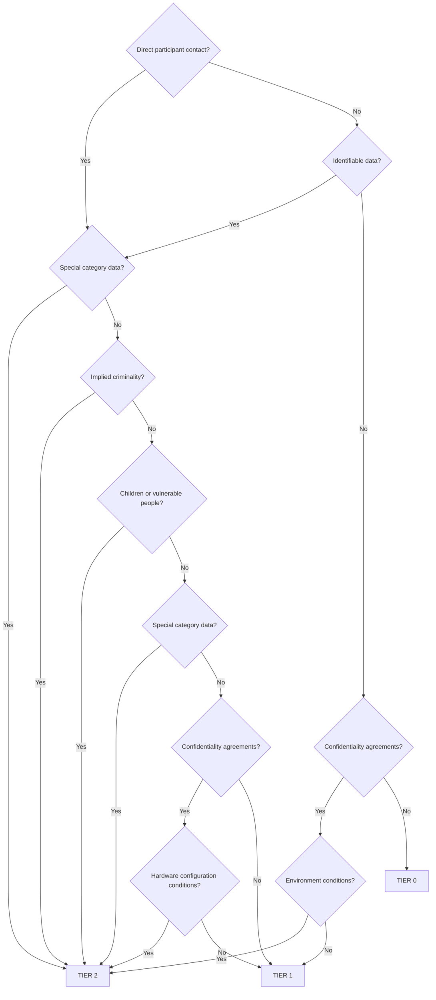

```mermaid
flowchart TD

	A{Direct participant contact?};
	A -- Yes --> C{Special category data?};
	A -- No --> B{Identifiable data?};
	B{Identifiable data?};
	B -- Yes --> C{Special category data?};
	B -- No --> I{Confidentiality agreements?};
	C{Special category data?};
	C -- Yes --> TIER_2[TIER 2];
	C -- No --> D{Implied criminality?};
	D{Implied criminality?};
	D -- Yes --> TIER_2[TIER 2];
	D -- No --> E{Children or vulnerable people?};
	E{Children or vulnerable people?};
	E -- Yes --> TIER_2[TIER 2];
	E -- No --> F{Special category data?};
	F{Special category data?};
	F -- Yes --> TIER_2[TIER 2];
	F -- No --> G{Confidentiality agreements?};
	G{Confidentiality agreements?};
	G -- Yes --> H{Hardware configuration conditions?};
	G -- No --> TIER_1[TIER 1];
	H{Hardware configuration conditions?};
	H -- Yes --> TIER_2[TIER 2];
	H -- No --> TIER_1[TIER 1];
	I{Confidentiality agreements?};
	I -- Yes --> J{Environment conditions?};
	I -- No --> TIER_0[TIER 0];
	J{Environment conditions?};
	J -- Yes --> TIER_2[TIER 2];
	J -- No --> TIER_1[TIER 1];
```